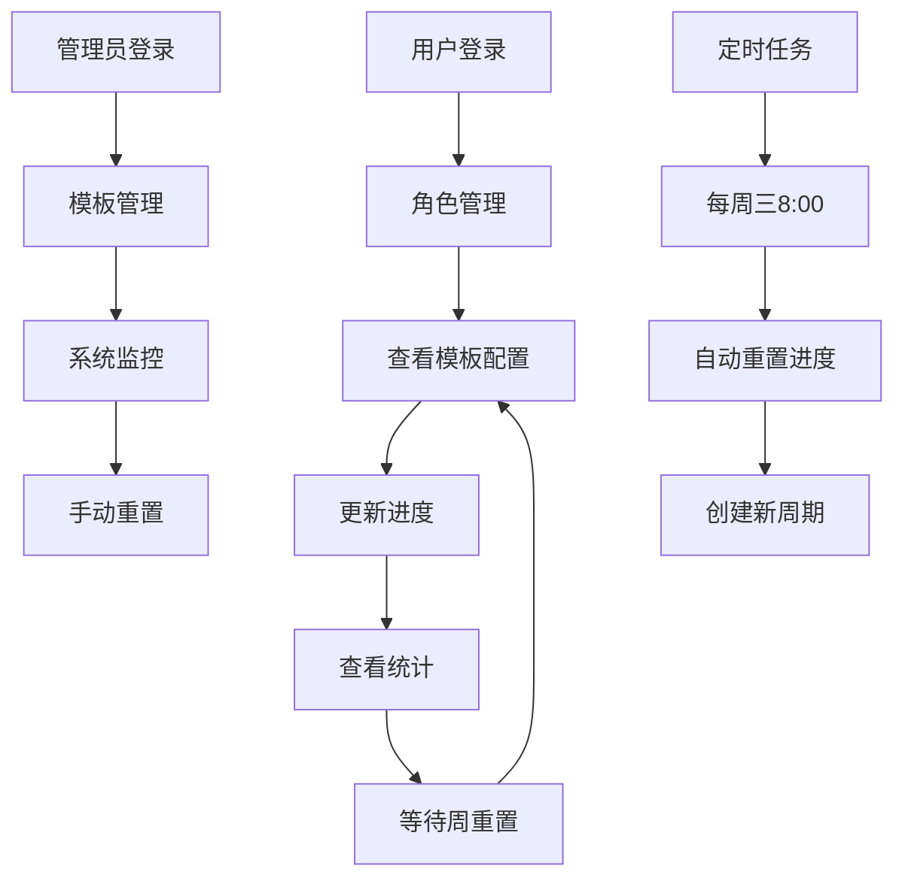

# 诛仙世界多账号每周活跃统计与管理系统 - 产品需求文档

## 1. 产品概述

诛仙世界多账号每周活跃统计与管理系统是一个专为游戏玩家设计的后端服务，用于统计和管理多个游戏角色的每周活跃进度。

- 该系统解决了玩家需要手动跟踪多个角色每周副本进度和周常任务完成情况的痛点，为 Windows 桌面应用提供稳定的数据支持。
- 目标用户是拥有多个游戏角色的诛仙世界玩家，帮助他们高效管理角色的每周活跃度，避免遗漏重要的周常任务和副本进度。
- 产品的市场价值在于提升玩家的游戏体验，通过自动化的进度跟踪和提醒，帮助玩家最大化游戏收益。

## 2. 核心功能

### 2.1 用户角色

| 角色 | 注册方法 | 核心权限 |
|------|----------|----------|
| 普通用户 | 手机号/邮箱注册 | 管理自己的角色和进度数据，查看全局模板配置 |
| 管理员用户 | 系统分配权限 | 管理全局副本模板和周常任务模板，执行系统维护操作 |

### 2.2 功能模块

我们的系统需求包含以下主要功能模块：

1. **用户认证模块**：用户注册、登录、退出登录功能
2. **角色管理模块**：游戏角色的增删改查操作
3. **模板配置模块**：副本模板和周常任务模板的管理
4. **进度跟踪模块**：每周活跃进度的记录和更新
5. **定时重置模块**：每周三自动重置所有用户进度

### 2.3 功能详情

| 功能模块 | 子功能 | 功能描述 |
|----------|--------|----------|
| 用户认证模块 | 用户注册 | 支持手机号/邮箱注册，密码安全哈希存储 |
| 用户认证模块 | 用户登录 | 支持用户名/手机号/邮箱多种方式登录，返回 JWT Token |
| 用户认证模块 | 退出登录 | 清除用户会话状态 |
| 角色管理模块 | 角色列表 | 获取当前用户所有游戏角色信息 |
| 角色管理模块 | 添加角色 | 创建新的游戏角色，设置角色名称和状态 |
| 角色管理模块 | 更新角色 | 修改角色名称和启用状态 |
| 角色管理模块 | 删除角色 | 删除指定角色及其相关进度数据 |
| 模板配置模块 | 副本模板查看 | 普通用户查看所有可用的副本模板配置 |
| 模板配置模块 | 周常模板查看 | 普通用户查看所有可用的周常任务模板 |
| 模板配置模块 | 模板管理 | 管理员创建、更新、删除副本和周常任务模板 |
| 进度跟踪模块 | 进度查询 | 获取用户所有角色的当前周进度和周期信息 |
| 进度跟踪模块 | 副本进度更新 | 更新指定角色的副本 BOSS 击杀状态 |
| 进度跟踪模块 | 周常进度更新 | 更新指定角色的周常任务完成次数 |
| 定时重置模块 | 自动重置 | 每周三 8:00 AM 自动重置所有用户的周活跃进度 |
| 定时重置模块 | 手动重置 | 管理员手动触发进度重置操作 |

## 3. 核心流程

### 普通用户流程
1. 用户注册/登录系统
2. 添加和管理自己的游戏角色
3. 查看可用的副本模板和周常任务模板
4. 更新角色的副本进度和周常任务完成情况
5. 查看当前周期的整体进度统计

### 管理员流程
1. 管理员登录系统
2. 管理全局副本模板（创建、更新、删除）
3. 管理全局周常任务模板（创建、更新、删除）
4. 监控系统运行状态和定时任务执行情况
5. 必要时手动触发进度重置操作

### 系统自动流程
每周三 8:00 AM 系统自动执行进度重置，为所有用户创建新的周期进度记录。

## 4. 用户界面设计

### 4.1 设计风格

- **主色调**：深蓝色 (#1a365d) 和金色 (#d69e2e)，体现游戏的神秘和华丽感
- **辅助色**：灰色 (#718096) 用于次要信息，绿色 (#38a169) 表示完成状态，红色 (#e53e3e) 表示未完成
- **按钮样式**：圆角按钮，带有轻微阴影效果，悬停时有颜色渐变
- **字体**：主要使用 14px-16px 的无衬线字体，标题使用 18px-24px
- **布局风格**：卡片式布局，顶部导航栏，左侧功能菜单
- **图标风格**：使用简洁的线性图标，配合游戏主题的装饰性元素

### 4.2 页面设计概览

| 功能模块 | 界面元素 | UI 设计要点 |
|----------|----------|-------------|
| 用户认证 | 登录表单 | 简洁的居中表单，深色背景，金色按钮，支持多种登录方式切换 |
| 角色管理 | 角色卡片列表 | 网格布局的角色卡片，显示角色名称、状态指示器，支持快速操作按钮 |
| 进度跟踪 | 进度表格 | 表格形式展示副本和周常进度，使用进度条和复选框，颜色编码完成状态 |
| 模板管理 | 配置面板 | 管理员专用的配置界面，表单和列表结合，支持拖拽排序 |
| 统计概览 | 仪表板 | 卡片式统计信息，进度环形图，倒计时组件显示距离重置的时间 |

### 4.3 响应式设计

本系统主要为 Windows 桌面应用提供后端服务，前端界面采用桌面优先的设计策略，最小支持 1024x768 分辨率，界面布局针对鼠标操作进行优化。