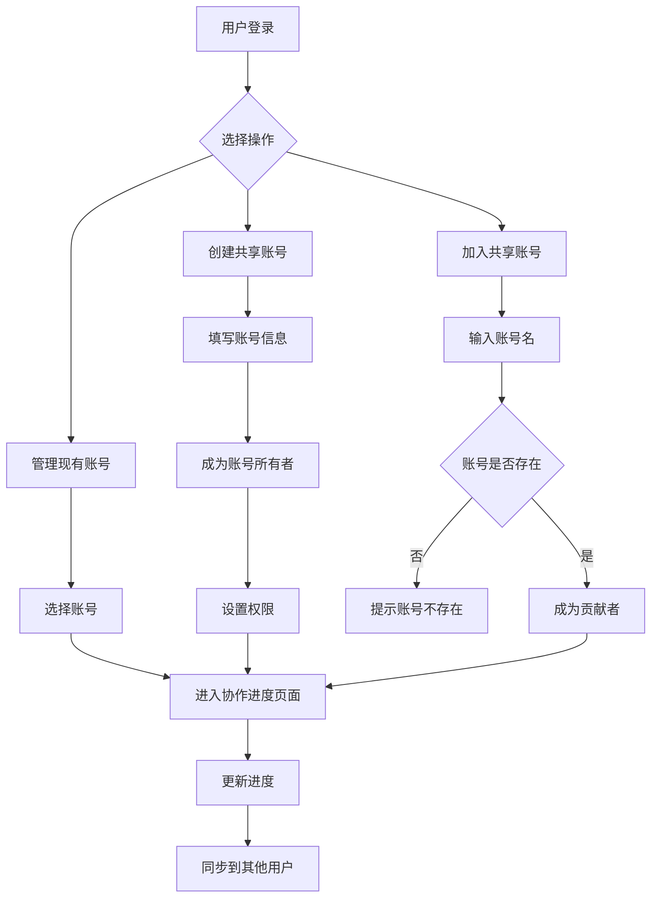

# 多用户共享账号功能产品需求文档

## 1. 产品概述

本项目旨在为诛仙多账号管理系统增加多用户协作功能，允许不同用户添加相同名称的游戏账号并共同管理其进度。通过实现账号共享机制，提升团队协作效率，解决多人管理同一游戏账号时的数据同步和权限管理问题。

该功能将显著提升用户协作体验，特别适用于公会管理、团队刷本等多人协作场景，预期能提升用户活跃度和平台粘性。

## 2. 核心功能

### 2.1 用户角色

| 角色 | 注册方法 | 核心权限 |
|------|----------|----------|
| 账号所有者 | 首次创建共享账号的用户 | 拥有账号的完全控制权，包括删除账号、管理其他用户权限 |
| 账号贡献者 | 通过账号名加入已存在的共享账号 | 可以查看和更新账号进度，无法删除账号或修改其他用户权限 |
| 系统管理员 | 后台管理权限 | 可以查看所有共享账号，管理用户权限，处理争议 |

### 2.2 功能模块

我们的多用户共享账号功能包含以下主要页面：

1. **共享账号管理页面**：账号创建/加入、账号列表展示、权限管理
2. **协作进度页面**：多用户进度同步、实时更新显示、操作历史记录
3. **权限设置页面**：用户权限配置、角色管理、访问控制
4. **账号详情页面**：账号信息展示、贡献者列表、统计数据

### 2.3 页面详情

| 页面名称 | 模块名称 | 功能描述 |
|----------|----------|----------|
| 共享账号管理页面 | 账号创建模块 | 创建新的共享账号，设置账号基本信息（账号名、显示名、服务器等） |
| 共享账号管理页面 | 账号加入模块 | 通过账号名搜索并加入已存在的共享账号，自动成为贡献者 |
| 共享账号管理页面 | 账号列表模块 | 展示用户参与的所有共享账号，支持筛选、排序、搜索功能 |
| 协作进度页面 | 进度同步模块 | 实时显示账号的副本进度和周常任务完成情况，支持多用户同时更新 |
| 协作进度页面 | 操作记录模块 | 显示所有用户的操作历史，包括进度更新时间、操作用户等信息 |
| 协作进度页面 | 冲突处理模块 | 处理多用户同时更新时的数据冲突，提供冲突解决机制 |
| 权限设置页面 | 用户权限模块 | 账号所有者可以设置其他用户的读写权限，管理用户角色 |
| 权限设置页面 | 访问控制模块 | 设置账号的访问策略，如是否允许新用户自由加入 |
| 账号详情页面 | 基本信息模块 | 显示账号的详细信息，包括创建时间、活跃状态等 |
| 账号详情页面 | 贡献者列表模块 | 展示所有参与该账号的用户列表，显示各自的权限和加入时间 |
| 账号详情页面 | 统计数据模块 | 显示账号的使用统计，如进度更新频率、活跃用户数等 |

## 3. 核心流程

### 3.1 账号所有者流程

1. 用户登录系统后，在共享账号管理页面点击"创建共享账号"
2. 填写账号基本信息（账号名、显示名、服务器名等）
3. 系统创建共享账号，用户自动成为账号所有者
4. 所有者可以在权限设置页面管理其他用户的访问权限
5. 所有者可以在协作进度页面更新账号的游戏进度
6. 所有者可以查看账号详情和所有贡献者信息

### 3.2 账号贡献者流程

1. 用户在共享账号管理页面输入想要加入的账号名
2. 系统检查账号是否存在，如存在则自动加入成为贡献者
3. 贡献者可以在协作进度页面查看和更新账号进度
4. 贡献者可以查看其他贡献者的操作记录
5. 贡献者可以在账号详情页面查看账号信息和贡献者列表

### 3.3 管理员流程

1. 管理员登录后台管理系统
2. 查看所有共享账号的使用情况和统计数据
3. 处理用户权限争议和账号管理问题
4. 监控系统运行状态和用户活动

## 4. 用户界面设计

### 4.1 设计风格

- **主色调**：#1890ff（蓝色）作为主色，#52c41a（绿色）作为成功状态色
- **辅助色**：#f0f0f0（浅灰）作为背景色，#595959（深灰）作为文字色
- **按钮样式**：圆角按钮设计，主要操作使用实心按钮，次要操作使用线框按钮
- **字体**：优先使用系统字体，中文使用微软雅黑，英文使用Segoe UI，字号14px为主体文字
- **布局风格**：卡片式布局，顶部导航栏设计，左侧菜单栏（可收缩）
- **图标风格**：使用Ant Design图标库，线性图标风格，保持一致性

### 4.2 页面设计概览

| 页面名称 | 模块名称 | UI元素 |
|----------|----------|---------|
| 共享账号管理页面 | 账号创建模块 | 模态框表单，包含账号名输入框、显示名输入框、服务器选择下拉框，主色调提交按钮 |
| 共享账号管理页面 | 账号列表模块 | 卡片式布局，每个账号显示为独立卡片，包含账号名、角色标签、最后更新时间，支持搜索框和筛选器 |
| 协作进度页面 | 进度同步模块 | 表格布局显示副本进度，使用进度条和复选框，实时更新标识使用绿色高亮 |
| 协作进度页面 | 操作记录模块 | 时间轴样式显示操作历史，包含用户头像、操作描述、时间戳，使用不同颜色区分操作类型 |
| 权限设置页面 | 用户权限模块 | 表格形式展示用户列表，权限使用开关组件，角色使用标签显示，操作按钮使用图标按钮 |
| 账号详情页面 | 统计数据模块 | 使用图表组件展示数据趋势，卡片式布局显示关键指标，使用数字动画效果 |

### 4.3 响应式设计

本系统采用桌面优先的响应式设计策略：
- **桌面端（>1200px）**：完整功能展示，三栏布局
- **平板端（768px-1200px）**：适配触摸操作，二栏布局，侧边栏可收缩
- **移动端（<768px）**：单栏布局，底部导航栏，优化触摸交互体验

移动端特别优化：
- 增大按钮点击区域（最小44px）
- 优化表单输入体验
- 使用下拉刷新和无限滚动
- 简化操作流程，减少页面跳转

## 5. 技术实现要点

### 5.1 数据同步机制

- **实时同步**：使用WebSocket实现多用户间的实时数据同步
- **冲突解决**：采用最后写入优先策略，配合操作时间戳
- **离线支持**：本地缓存机制，网络恢复后自动同步

### 5.2 权限控制

- **角色权限**：基于角色的权限控制（RBAC）
- **操作权限**：细粒度的操作权限控制（读取、写入、删除）
- **数据隔离**：确保用户只能访问有权限的账号数据

### 5.3 性能优化

- **分页加载**：大数据量采用分页或虚拟滚动
- **缓存策略**：合理使用前端缓存减少API调用
- **懒加载**：非关键数据采用懒加载策略

## 6. 用户体验优化

### 6.1 操作反馈

- **加载状态**：所有异步操作提供加载指示器
- **操作结果**：成功/失败操作提供明确的反馈信息
- **进度指示**：长时间操作提供进度条显示

### 6.2 错误处理

- **友好错误提示**：将技术错误转换为用户易懂的提示
- **操作指导**：错误发生时提供解决建议
- **重试机制**：网络错误时提供重试选项

### 6.3 快捷操作

- **批量操作**：支持批量更新进度、批量权限设置
- **快捷键**：常用操作提供键盘快捷键支持
- **操作历史**：记录用户操作历史，支持快速重复操作

## 7. 安全性考虑

### 7.1 数据安全

- **权限验证**：所有API调用进行严格的权限验证
- **数据加密**：敏感数据传输使用HTTPS加密
- **输入验证**：前后端双重输入验证防止恶意数据

### 7.2 操作审计

- **操作日志**：记录所有关键操作的详细日志
- **异常监控**：监控异常操作行为，及时预警
- **数据备份**：定期备份重要数据，支持数据恢复

## 8. 成功指标

### 8.1 功能指标

- **账号共享率**：至少30%的账号被多个用户共享
- **协作活跃度**：每个共享账号平均有2.5个活跃贡献者
- **数据同步准确率**：99.9%的进度更新能够正确同步

### 8.2 用户体验指标

- **页面加载时间**：主要页面加载时间控制在2秒内
- **操作响应时间**：用户操作响应时间控制在500ms内
- **用户满意度**：用户满意度评分达到4.5分以上（5分制）

### 8.3 业务指标

- **用户留存率**：使用共享功能的用户7日留存率提升20%
- **功能使用率**：60%的活跃用户使用共享账号功能
- **协作效率**：团队管理账号的效率提升40%

## 9. 风险评估与应对

### 9.1 技术风险

| 风险 | 影响程度 | 应对措施 |
|------|----------|----------|
| 数据同步冲突 | 高 | 实现冲突检测和解决机制，提供手动解决选项 |
| 性能瓶颈 | 中 | 数据库优化、缓存策略、负载均衡 |
| 权限漏洞 | 高 | 多层权限验证、安全审计、渗透测试 |

### 9.2 业务风险

| 风险 | 影响程度 | 应对措施 |
|------|----------|----------|
| 用户接受度低 | 中 | 用户调研、功能优化、使用引导 |
| 数据争议 | 中 | 明确权限规则、操作审计、争议处理流程 |
| 系统复杂度增加 | 低 | 模块化设计、文档完善、团队培训 |

## 10. 实施计划

### 10.1 开发里程碑

| 里程碑 | 完成时间 | 主要交付物 |
|--------|----------|------------|
| 需求确认 | 第1周 | 产品需求文档、技术方案文档 |
| 数据库设计 | 第2周 | 数据库架构设计、迁移脚本 |
| 后端开发 | 第3-4周 | API接口、权限系统、数据服务 |
| 前端开发 | 第4-5周 | 用户界面、交互逻辑、数据绑定 |
| 集成测试 | 第6周 | 功能测试、性能测试、安全测试 |
| 用户验收 | 第7周 | 用户测试、反馈收集、问题修复 |
| 上线部署 | 第8周 | 生产部署、监控配置、用户培训 |

### 10.2 资源需求

- **开发人员**：后端开发1人、前端开发1人、测试工程师1人
- **设计资源**：UI设计师0.5人、产品经理0.5人
- **基础设施**：数据库升级、服务器扩容、监控系统

## 11. 后续优化方向

### 11.1 功能增强

- **智能推荐**：基于用户行为推荐相关账号和协作伙伴
- **数据分析**：提供详细的数据分析和报表功能
- **移动应用**：开发专门的移动端应用

### 11.2 集成扩展

- **第三方集成**：与游戏官方API集成，自动同步数据
- **社交功能**：增加用户间的社交互动功能
- **通知系统**：完善的消息通知和提醒机制

通过实施这个多用户共享账号功能，我们将显著提升用户的协作体验，增强平台的竞争力和用户粘性。