# 诛仙世界多账号管理系统 - 技术架构文档

## 1. 架构设计


## 2. 技术描述

- **后端框架**：NestJS@10 + TypeScript@5 + Node.js@18
- **数据库**：MySQL@8.0 + TypeORM@0.3
- **认证授权**：Passport.js + JWT + bcrypt
- **定时任务**：@nestjs/schedule + node-cron
- **配置管理**：@nestjs/config + dotenv
- **API 文档**：Swagger/OpenAPI
- **容器化**：Docker + Docker Compose

## 3. 路由定义

| 路由 | 用途 |
|------|------|
| /auth/register | 用户注册接口 |
| /auth/login | 用户登录接口，返回 JWT Token |
| /auth/logout | 用户退出登录接口 |
| /accounts | 角色管理接口，支持 CRUD 操作 |
| /accounts/:id | 单个角色的详细操作接口 |
| /templates/dungeons | 副本模板管理接口 |
| /templates/tasks | 周常任务模板管理接口 |
| /progress | 获取用户所有角色的进度数据 |
| /progress/dungeon | 更新角色副本进度接口 |
| /progress/task | 更新角色周常任务进度接口 |
| /progress/reset | 手动触发进度重置接口（管理员） |

## 4. API 定义

### 4.1 核心 API

#### 用户认证相关

```
POST /auth/register
```

请求参数：
| 参数名 | 参数类型 | 是否必需 | 描述 |
|--------|----------|----------|------|
| username | string | true | 用户名 |
| email | string | false | 邮箱地址 |
| phone | string | false | 手机号码 |
| password | string | true | 密码（明文，后端加密） |

响应参数：
| 参数名 | 参数类型 | 描述 |
|--------|----------|------|
| success | boolean | 注册是否成功 |
| message | string | 响应消息 |
| userId | string | 用户 ID（成功时返回） |

```
POST /auth/login
```

请求参数：
| 参数名 | 参数类型 | 是否必需 | 描述 |
|--------|----------|----------|------|
| credential | string | true | 登录凭证（用户名/邮箱/手机号） |
| password | string | true | 密码 |

响应参数：
| 参数名 | 参数类型 | 描述 |
|--------|----------|------|
| success | boolean | 登录是否成功 |
| accessToken | string | JWT 访问令牌 |
| user | object | 用户基本信息 |

#### 角色管理相关

```
GET /accounts
```

响应参数：
| 参数名 | 参数类型 | 描述 |
|--------|----------|------|
| accounts | array | 角色列表 |
| total | number | 角色总数 |

```
POST /accounts
```

请求参数：
| 参数名 | 参数类型 | 是否必需 | 描述 |
|--------|----------|----------|------|
| name | string | true | 角色名称 |
| isActive | boolean | false | 是否启用（默认 true） |

#### 进度管理相关

```
GET /progress
```

响应参数：
| 参数名 | 参数类型 | 描述 |
|--------|----------|------|
| weekStart | string | 当前周期开始时间 |
| weekEnd | string | 当前周期结束时间 |
| accounts | array | 所有角色的进度数据 |

```
PUT /progress/dungeon
```

请求参数：
| 参数名 | 参数类型 | 是否必需 | 描述 |
|--------|----------|----------|------|
| accountId | string | true | 角色 ID |
| templateId | string | true | 副本模板 ID |
| bossIndex | number | true | BOSS 索引 |
| isCompleted | boolean | true | 是否完成 |

示例请求：
```json
{
  "accountId": "uuid-account-1",
  "templateId": "uuid-dungeon-1",
  "bossIndex": 0,
  "isCompleted": true
}
```

## 5. 服务器架构图


## 6. 数据模型

### 6.1 数据模型定义

```mermaid
erDiagram
    USER ||--o{ ACCOUNT : owns
    ACCOUNT ||--o{ WEEKLY_PROGRESS : has
    DUNGEON_TEMPLATE ||--o{ WEEKLY_PROGRESS : references
    WEEKLY_TASK_TEMPLATE ||--o{ WEEKLY_PROGRESS : references

    USER {
        varchar userId PK
        varchar username
        varchar email
        varchar phone
        varchar passwordHash
        datetime createdAt
        datetime updatedAt
    }
    
    ACCOUNT {
        varchar accountId PK
        varchar userId FK
        varchar name
        boolean isActive
        datetime createdAt
        datetime updatedAt
    }
    
    DUNGEON_TEMPLATE {
        varchar templateId PK
        varchar dungeonName
        json bosses
        datetime createdAt
        datetime updatedAt
    }
    
    WEEKLY_TASK_TEMPLATE {
        varchar templateId PK
        varchar taskName
        int targetCount
        datetime createdAt
        datetime updatedAt
    }
    
    WEEKLY_PROGRESS {
        varchar progressId PK
        varchar accountId FK
        date weekStart
        json dungeonProgress
        json weeklyTaskProgress
        datetime lastUpdated
    }
```



### 6.2 数据定义语言

#### 用户表 (users)
```sql
-- 创建用户表
CREATE TABLE users (
    userId VARCHAR(36) PRIMARY KEY DEFAULT (UUID()),
    username VARCHAR(50) NOT NULL UNIQUE,
    email VARCHAR(100) UNIQUE,
    phone VARCHAR(20) UNIQUE,
    passwordHash VARCHAR(255) NOT NULL,
    createdAt TIMESTAMP DEFAULT CURRENT_TIMESTAMP,
    updatedAt TIMESTAMP DEFAULT CURRENT_TIMESTAMP ON UPDATE CURRENT_TIMESTAMP
);

-- 创建索引
CREATE INDEX idx_users_username ON users(username);
CREATE INDEX idx_users_email ON users(email);
CREATE INDEX idx_users_phone ON users(phone);
```

#### 角色表 (accounts)
```sql
-- 创建角色表
CREATE TABLE accounts (
    accountId VARCHAR(36) PRIMARY KEY DEFAULT (UUID()),
    userId VARCHAR(36) NOT NULL,
    name VARCHAR(50) NOT NULL,
    isActive BOOLEAN DEFAULT TRUE,
    createdAt TIMESTAMP DEFAULT CURRENT_TIMESTAMP,
    updatedAt TIMESTAMP DEFAULT CURRENT_TIMESTAMP ON UPDATE CURRENT_TIMESTAMP,
    FOREIGN KEY (userId) REFERENCES users(userId) ON DELETE CASCADE
);

-- 创建索引
CREATE INDEX idx_accounts_userId ON accounts(userId);
CREATE INDEX idx_accounts_name ON accounts(name);
```

#### 副本模板表 (dungeon_templates)
```sql
-- 创建副本模板表
CREATE TABLE dungeon_templates (
    templateId VARCHAR(36) PRIMARY KEY DEFAULT (UUID()),
    dungeonName VARCHAR(100) NOT NULL,
    bosses JSON NOT NULL,
    createdAt TIMESTAMP DEFAULT CURRENT_TIMESTAMP,
    updatedAt TIMESTAMP DEFAULT CURRENT_TIMESTAMP ON UPDATE CURRENT_TIMESTAMP
);

-- 创建索引
CREATE INDEX idx_dungeon_templates_name ON dungeon_templates(dungeonName);
```

#### 周常任务模板表 (weekly_task_templates)
```sql
-- 创建周常任务模板表
CREATE TABLE weekly_task_templates (
    templateId VARCHAR(36) PRIMARY KEY DEFAULT (UUID()),
    taskName VARCHAR(100) NOT NULL,
    targetCount INT NOT NULL DEFAULT 1,
    createdAt TIMESTAMP DEFAULT CURRENT_TIMESTAMP,
    updatedAt TIMESTAMP DEFAULT CURRENT_TIMESTAMP ON UPDATE CURRENT_TIMESTAMP
);

-- 创建索引
CREATE INDEX idx_weekly_task_templates_name ON weekly_task_templates(taskName);
```

#### 每周进度表 (weekly_progress)
```sql
-- 创建每周进度表
CREATE TABLE weekly_progress (
    progressId VARCHAR(36) PRIMARY KEY DEFAULT (UUID()),
    accountId VARCHAR(36) NOT NULL,
    weekStart DATE NOT NULL,
    dungeonProgress JSON,
    weeklyTaskProgress JSON,
    lastUpdated TIMESTAMP DEFAULT CURRENT_TIMESTAMP ON UPDATE CURRENT_TIMESTAMP,
    FOREIGN KEY (accountId) REFERENCES accounts(accountId) ON DELETE CASCADE
);

-- 创建索引
CREATE INDEX idx_weekly_progress_accountId ON weekly_progress(accountId);
CREATE INDEX idx_weekly_progress_weekStart ON weekly_progress(weekStart);
CREATE UNIQUE INDEX idx_weekly_progress_account_week ON weekly_progress(accountId, weekStart);
```

#### 初始化数据
```sql
-- 插入默认副本模板
INSERT INTO dungeon_templates (dungeonName, bosses) VALUES
('10人古龙', '["老一", "老二", "老三"]'),
('25人古龙', '["老一", "老二", "老三", "老四"]'),
('英雄副本', '["精英怪", "BOSS"]');

-- 插入默认周常任务模板
INSERT INTO weekly_task_templates (taskName, targetCount) VALUES
('门派活动', 5),
('日常任务', 7),
('竞技场', 10),
('帮派任务', 3);
```