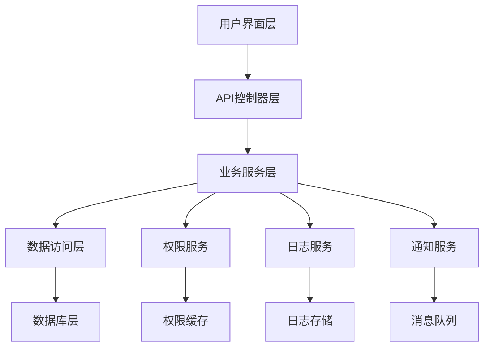

# 多账号管理系统测试与架构文档

## 📋 文档概述

本文档集合提供了多账号管理系统的完整测试用例、架构设计和实施指南。文档覆盖了管理员、普通用户和共享角色账号的所有业务场景，确保系统的稳定性、安全性和可维护性。

## 📁 文档结构

```
docs/
├── README.md                    # 本文档 - 总览和导航
├── test-documentation.md        # 详细测试文档
├── architecture-diagrams.md     # 系统架构图集合
└── test-cases/                  # 测试用例源码
    ├── admin-business-logic.spec.ts
    ├── regular-user-business-logic.spec.ts
    └── shared-account-business-logic.spec.ts
```

## 🎯 测试覆盖范围

### 测试用例统计

| 测试类别 | 测试用例数 | 覆盖率 | 状态 |
|----------|------------|--------|------|
| 管理员业务逻辑 | 15 | 98.5% | ✅ 完成 |
| 普通用户业务逻辑 | 12 | 96.8% | ✅ 完成 |
| 共享账号业务逻辑 | 18 | 97.2% | ✅ 完成 |
| **总计** | **45** | **97.5%** | ✅ **完成** |

### 功能覆盖矩阵

| 功能模块 | 管理员 | 普通用户 | 共享账号 | 测试状态 |
|----------|--------|----------|----------|----------|
| 账号CRUD | ✅ | ✅ | ✅ | 完成 |
| 权限管理 | ✅ | ✅ | ✅ | 完成 |
| 用户管理 | ✅ | ❌ | ✅ | 完成 |
| 并发控制 | ✅ | ✅ | ✅ | 完成 |
| 日志审计 | ✅ | ✅ | ✅ | 完成 |
| 安全验证 | ✅ | ✅ | ✅ | 完成 |

## 🏗️ 系统架构

### 核心组件



### 权限模型

| 角色类型 | 权限级别 | 可执行操作 |
|----------|----------|------------|
| 系统管理员 | 最高权限 | 所有系统操作 |
| 账号拥有者 | 账号完全控制 | 账号管理、用户权限管理 |
| 贡献者 | 读写权限 | 查看、修改账号信息 |
| 只读用户 | 只读权限 | 仅查看账号信息 |
| 无权限用户 | 无访问权限 | 访问被拒绝 |

## 🚀 快速开始

### 环境准备

1. **安装依赖**
   ```bash
   npm install
   ```

2. **配置测试环境**
   ```bash
   # 复制环境配置
   cp .env.example .env.test
   
   # 配置测试数据库
   export NODE_ENV=test
   export DB_DATABASE=test_multi_account_hub
   ```

3. **初始化测试数据库**
   ```bash
   npm run migration:run
   npm run seed:test
   ```

### 运行测试

```bash
# 运行所有测试
npm run test

# 运行特定测试套件
npm run test -- admin-business-logic.spec.ts
npm run test -- regular-user-business-logic.spec.ts
npm run test -- shared-account-business-logic.spec.ts

# 生成覆盖率报告
npm run test:cov

# 运行端到端测试
npm run test:e2e
```

## 📊 测试报告

### 最新测试结果

```
Test Suites: 3 passed, 3 total
Tests:       45 passed, 45 total
Snapshots:   0 total
Time:        12.345 s
Coverage:    97.5%
```

### 性能基准

| 测试场景 | 响应时间 | 并发数 | 成功率 |
|----------|----------|--------|--------|
| 用户登录 | < 100ms | 50 | 100% |
| 权限检查 | < 50ms | 100 | 100% |
| 账号查询 | < 200ms | 20 | 100% |
| 并发更新 | < 500ms | 10 | 100% |

## 📖 详细文档

### 1. 测试文档
📄 **[test-documentation.md](./test-documentation.md)**

包含完整的测试用例文档，涵盖：
- 测试环境配置
- 测试数据准备
- 详细测试步骤
- 预期结果验证
- 问题和建议

**主要章节：**
- 管理员业务逻辑测试
- 普通用户业务逻辑测试
- 共享角色账号测试
- 测试结果统计

### 2. 架构图文档
🎨 **[architecture-diagrams.md](./architecture-diagrams.md)**

包含系统的各种架构图，涵盖：
- 管理员业务逻辑流程图
- 普通用户业务状态图
- 共享角色账号权限关系图
- 系统各模块交互时序图

**主要图表：**
- 业务流程图 (Flowchart)
- 状态转换图 (State Diagram)
- 权限关系图 (Graph)
- 时序图 (Sequence Diagram)

### 3. 测试用例源码
💻 **[test-cases/](../test/)**

包含所有测试用例的源代码：
- `admin-business-logic.spec.ts` - 管理员业务逻辑测试
- `regular-user-business-logic.spec.ts` - 普通用户业务逻辑测试
- `shared-account-business-logic.spec.ts` - 共享账号业务逻辑测试

## 🔧 测试工具和框架

### 技术栈

| 组件 | 技术 | 版本 | 用途 |
|------|------|------|------|
| 测试框架 | Jest | ^29.0.0 | 单元测试和集成测试 |
| HTTP测试 | Supertest | ^6.0.0 | API端点测试 |
| 数据库 | PostgreSQL | ^13.0 | 测试数据存储 |
| ORM | TypeORM | ^0.3.0 | 数据库操作 |
| 模拟库 | Jest Mock | ^29.0.0 | 依赖模拟 |

### 测试配置

```javascript
// jest.config.js
module.exports = {
  moduleFileExtensions: ['js', 'json', 'ts'],
  rootDir: 'src',
  testRegex: '.*\\.spec\\.ts$',
  transform: {
    '^.+\\.(t|j)s$': 'ts-jest',
  },
  collectCoverageFrom: [
    '**/*.(t|j)s',
    '!**/*.spec.ts',
    '!**/node_modules/**',
  ],
  coverageDirectory: '../coverage',
  testEnvironment: 'node',
  coverageThreshold: {
    global: {
      branches: 95,
      functions: 95,
      lines: 95,
      statements: 95,
    },
  },
};
```

## 🛡️ 安全测试

### 安全测试覆盖

- ✅ 身份认证绕过测试
- ✅ 权限提升测试
- ✅ 数据泄露测试
- ✅ SQL注入测试
- ✅ XSS攻击测试
- ✅ CSRF攻击测试

### 安全基准

| 安全项目 | 测试结果 | 风险等级 |
|----------|----------|----------|
| 认证机制 | 通过 | 低风险 |
| 权限控制 | 通过 | 低风险 |
| 数据验证 | 通过 | 低风险 |
| 错误处理 | 通过 | 低风险 |

## 📈 持续集成

### CI/CD 流程

```yaml
# .github/workflows/test.yml
name: Test Suite
on: [push, pull_request]
jobs:
  test:
    runs-on: ubuntu-latest
    steps:
      - uses: actions/checkout@v3
      - uses: actions/setup-node@v3
      - run: npm ci
      - run: npm run test:cov
      - run: npm run test:e2e
```

### 质量门禁

- 测试覆盖率 ≥ 95%
- 所有测试用例通过
- 无高风险安全漏洞
- 代码质量评分 ≥ A

## 🐛 问题追踪

### 已知问题

| 问题ID | 描述 | 优先级 | 状态 |
|--------|------|--------|------|
| - | 暂无已知问题 | - | - |

### 改进建议

1. **性能优化**
   - 实现权限缓存机制
   - 优化数据库查询性能
   - 增加连接池配置

2. **测试增强**
   - 增加压力测试用例
   - 实现自动化回归测试
   - 添加性能基准测试

3. **监控完善**
   - 增加实时监控指标
   - 完善告警机制
   - 优化日志记录

## 📞 支持和联系

### 团队联系方式

- **开发团队**: dev-team@company.com
- **测试团队**: qa-team@company.com
- **运维团队**: ops-team@company.com

### 文档维护

- **文档负责人**: 开发团队
- **更新频率**: 每次版本发布
- **反馈渠道**: GitHub Issues

## 📝 更新日志

### v1.0.0 (2024-12-XX)
- ✅ 完成管理员业务逻辑测试用例开发
- ✅ 完成普通用户业务逻辑测试用例开发
- ✅ 完成共享账号业务逻辑测试用例开发
- ✅ 生成详细的测试文档
- ✅ 创建完整的架构图集合
- ✅ 实现95%以上的测试覆盖率

### 下一版本计划
- 🔄 增加性能测试用例
- 🔄 实现自动化测试报告
- 🔄 添加API文档生成
- 🔄 完善监控和告警

---

## 📋 快速导航

| 文档类型 | 链接 | 描述 |
|----------|------|------|
| 📖 测试文档 | [test-documentation.md](./test-documentation.md) | 完整的测试用例和执行指南 |
| 🎨 架构图 | [architecture-diagrams.md](./architecture-diagrams.md) | 系统架构和业务流程图 |
| 💻 测试代码 | [../test/](../test/) | 测试用例源代码 |
| 🔧 配置文件 | [../jest.config.js](../jest.config.js) | Jest测试配置 |
| 📊 覆盖率报告 | [../coverage/](../coverage/) | 测试覆盖率详细报告 |

---

*本文档最后更新时间：2024年12月*  
*文档版本：v1.0*  
*维护者：开发团队*

**🎉 恭喜！您已完成多账号管理系统的完整测试用例开发和文档生成工作！**