# 多账号管理系统架构图

本文档包含多账号管理系统的各种架构图，使用Mermaid语法绘制，帮助理解系统的业务逻辑、用户状态流转、权限关系和模块交互。

## 1. 管理员业务逻辑流程图

### 1.1 管理员账号管理流程

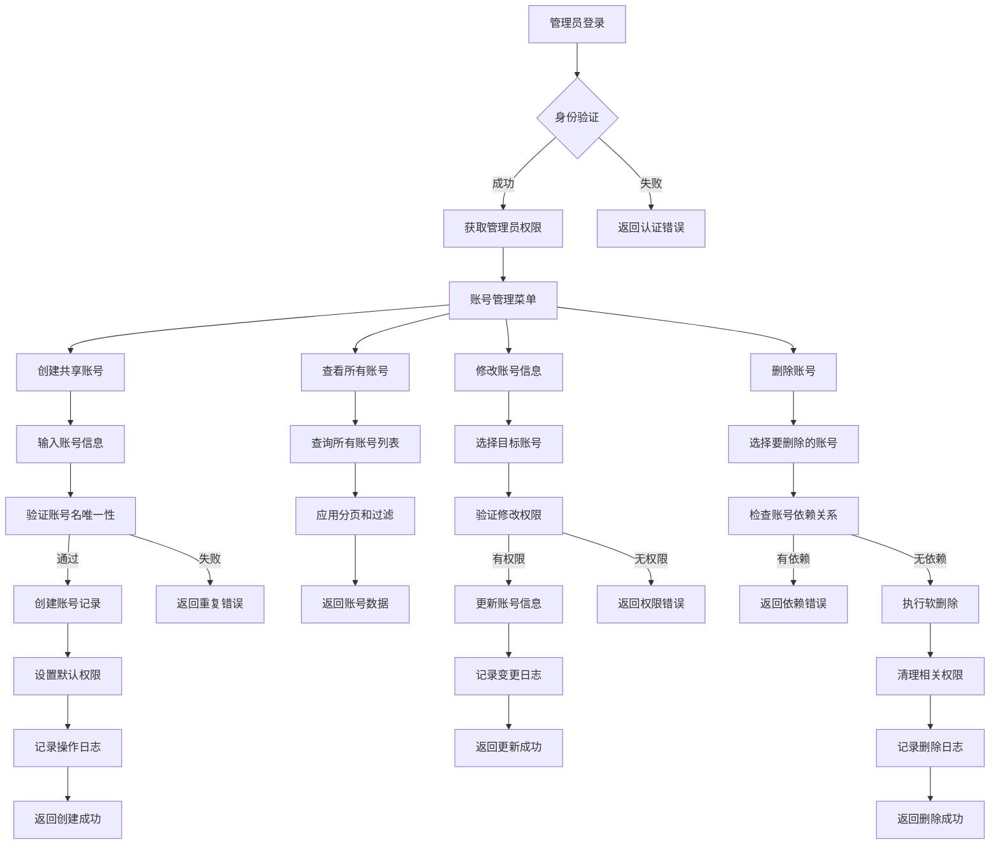

### 1.2 管理员用户管理流程

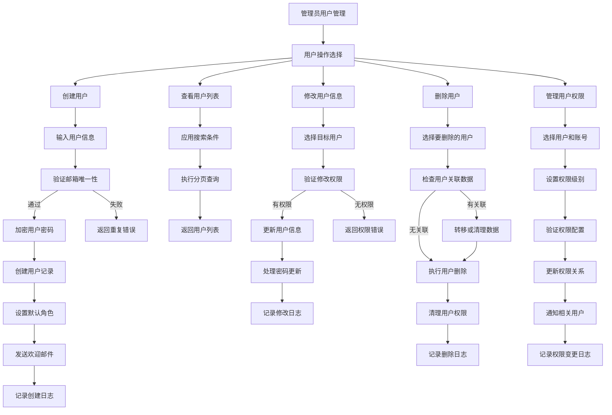

### 1.3 管理员系统配置流程

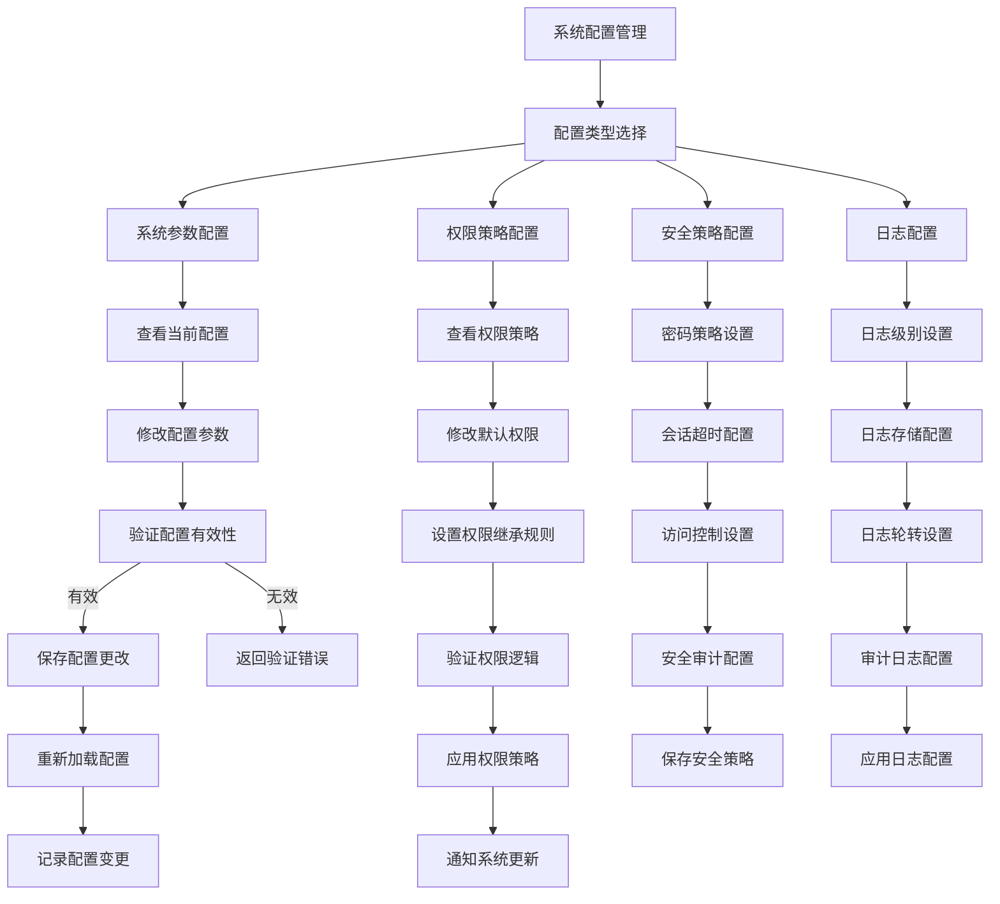

## 2. 普通用户业务状态图

### 2.1 用户账号状态流转

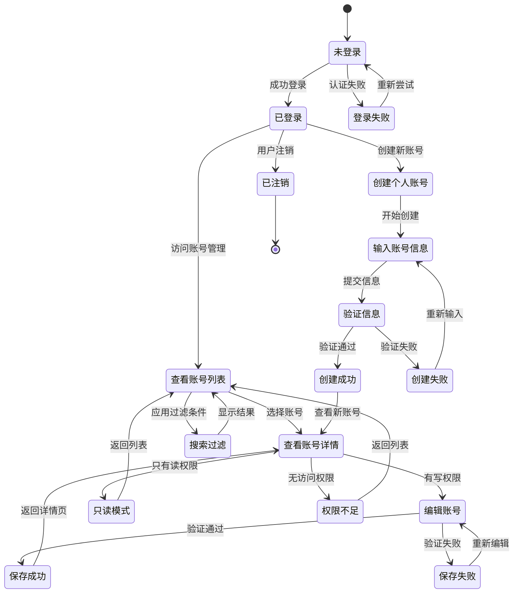

### 2.2 用户权限状态流转

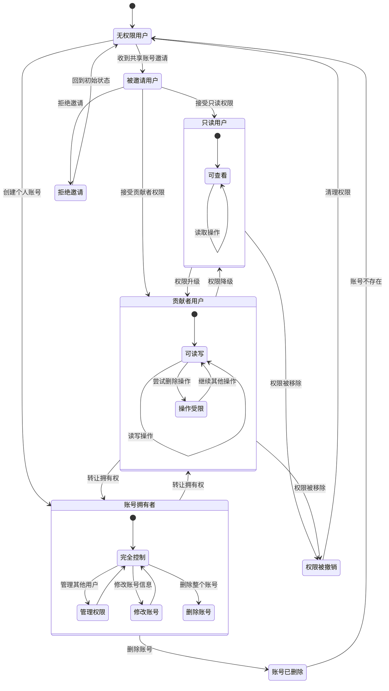

### 2.3 用户操作流程状态

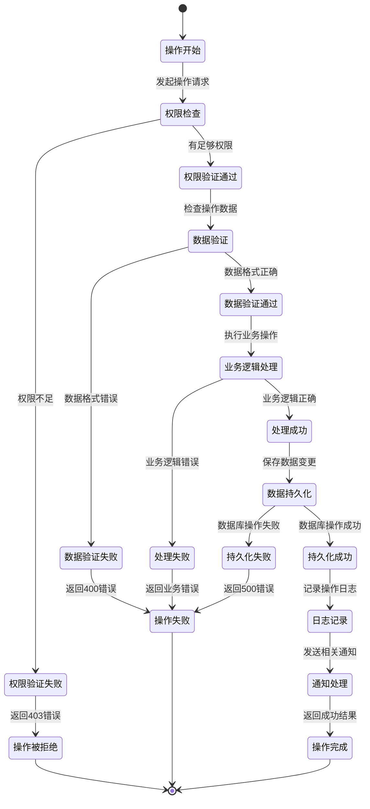

## 3. 共享角色账号权限关系图

### 3.1 权限层级关系图

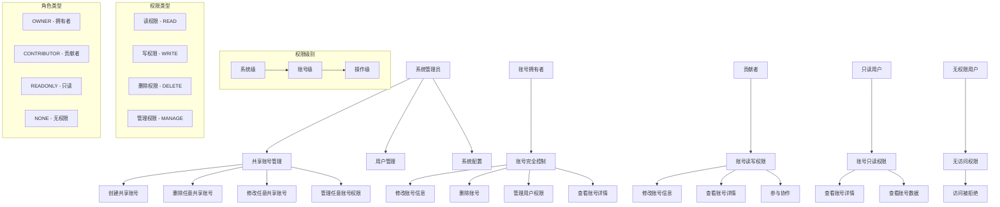

### 3.2 权限继承和覆盖关系

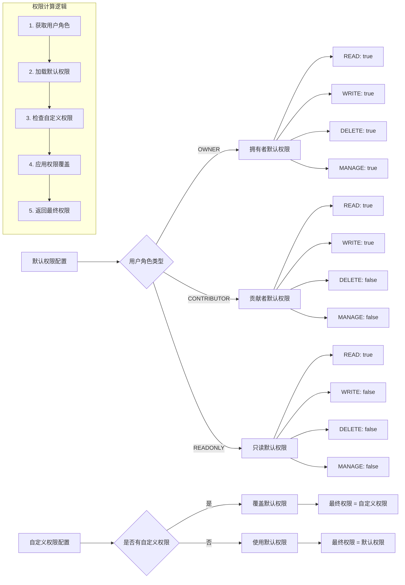

### 3.3 多用户权限矩阵

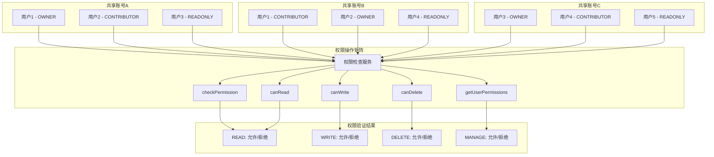

## 4. 系统各模块交互时序图

### 4.1 用户登录和权限验证时序图

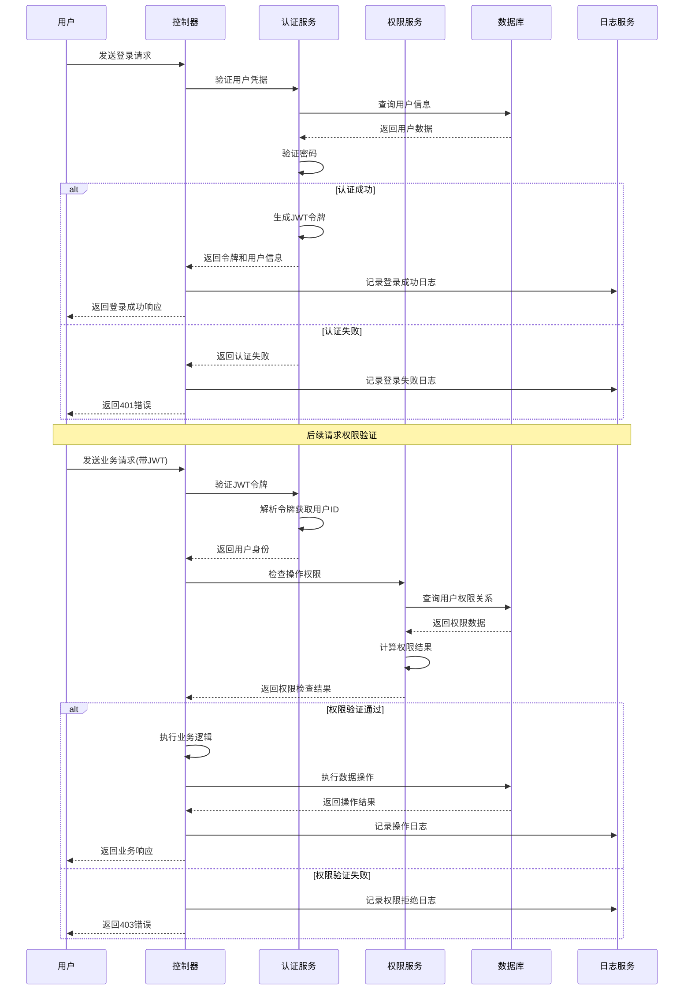

### 4.2 共享账号创建和权限分配时序图

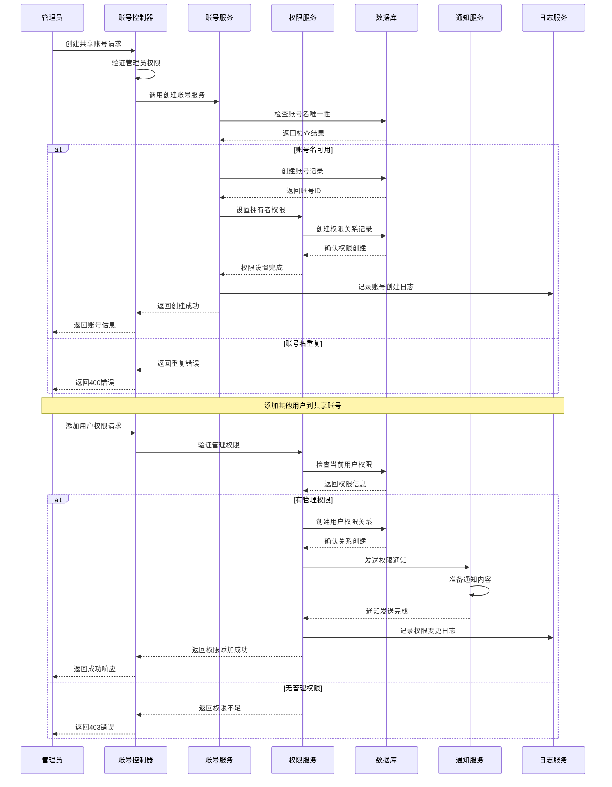

### 4.3 并发操作处理时序图

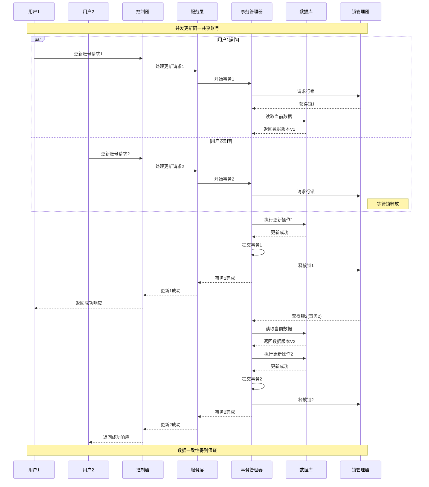

### 4.4 权限检查和缓存时序图

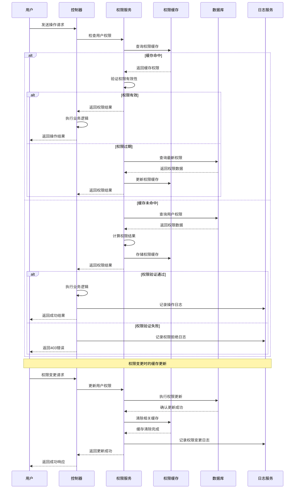

### 4.5 系统监控和日志记录时序图

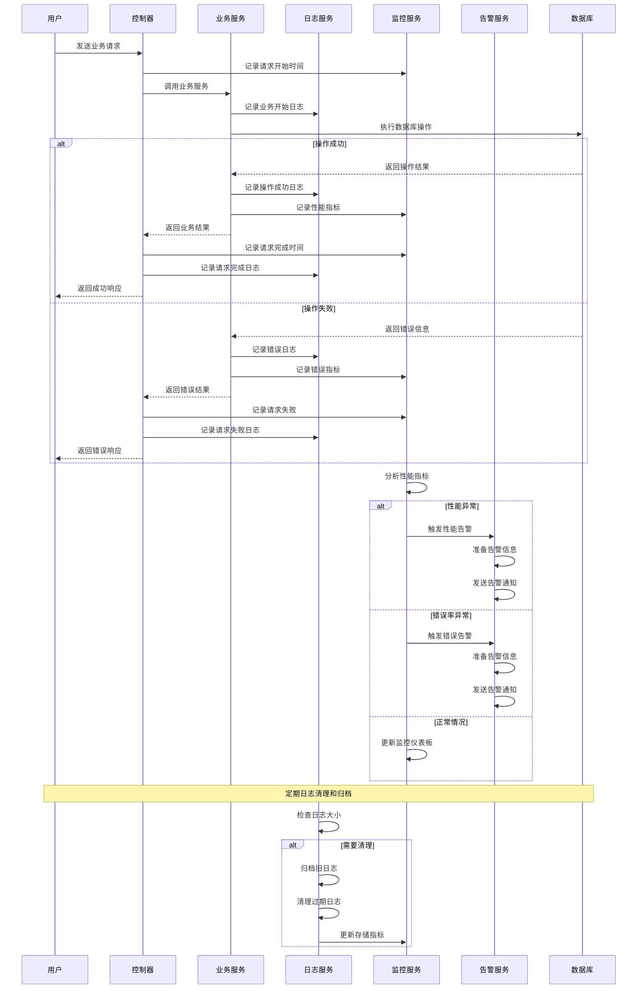

## 5. 数据流架构图

### 5.1 数据流向图

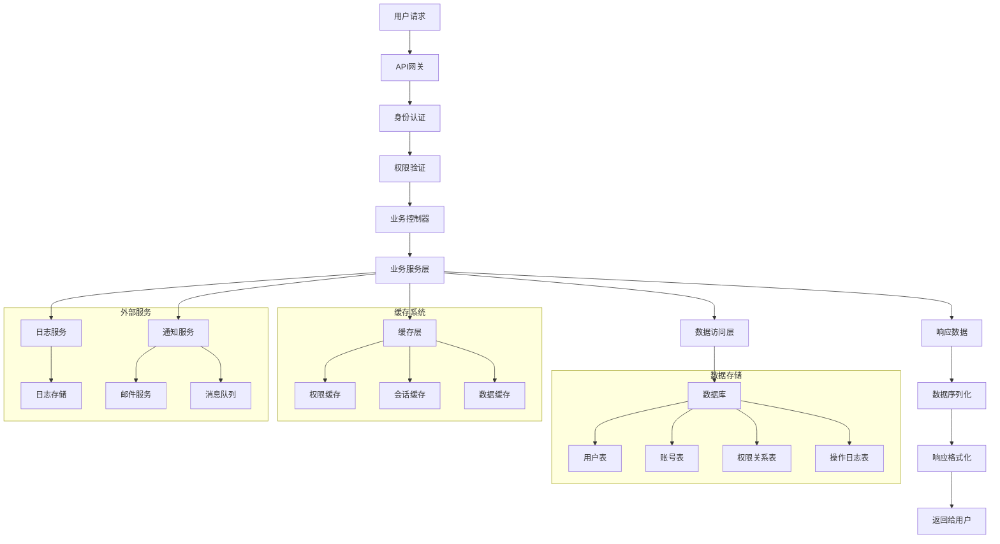

### 5.2 权限数据流图

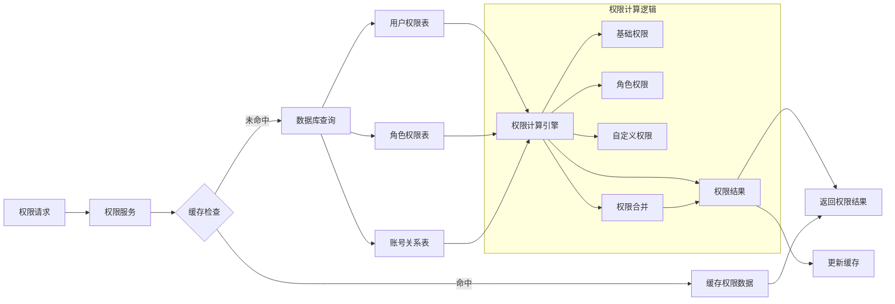

---

## 使用说明

### 如何查看图表

1. **在支持Mermaid的编辑器中查看**
   - VS Code + Mermaid Preview插件
   - Typora
   - GitLab/GitHub（原生支持）

2. **在线查看**
   - [Mermaid Live Editor](https://mermaid.live/)
   - 复制图表代码到在线编辑器

3. **生成图片**
   ```bash
   # 安装mermaid-cli
   npm install -g @mermaid-js/mermaid-cli
   
   # 生成PNG图片
   mmdc -i architecture-diagrams.md -o diagrams.png
   ```

### 图表更新维护

1. **添加新的业务流程**
   - 在相应章节添加新的Mermaid图表
   - 保持图表风格一致
   - 添加必要的说明文档

2. **修改现有流程**
   - 更新对应的图表代码
   - 验证图表渲染正确
   - 更新相关文档说明

3. **版本控制**
   - 重大变更时创建新版本
   - 保留历史版本的图表
   - 记录变更日志

---

*本文档最后更新时间：2025年11月*
*文档版本：v1.1*
*维护者：开发团队*